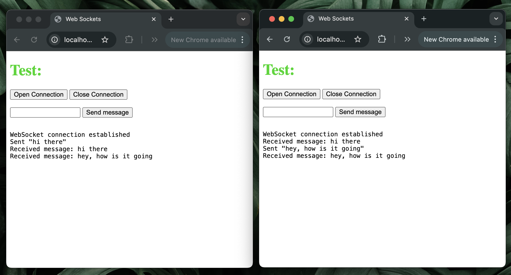
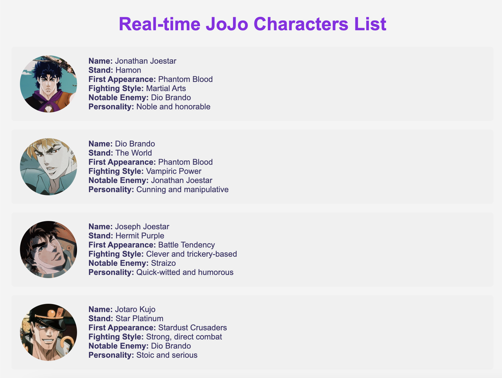

# WebSockets Chat Application

A real-time chat application demonstrating WebSocket implementation with Express.js and TypeScript. This project showcases bidirectional communication between clients and server through WebSockets protocol.

## 🚀 Features

- **Real-time Communication**: Instant message broadcasting to all connected clients
- **WebSocket Protocol**: Implementation using the `ws` library
- **Express.js Backend**: RESTful API alongside WebSocket functionality
- **TypeScript**: Type-safe implementation for better development experience
- **Error Handling**: Comprehensive middleware for API error management
- **Static File Serving**: HTML, CSS, and client-side JavaScript

## 📋 Prerequisites

- Node.js (v14.x or higher)
- npm

## 🛠️ Installation

1. Clone the repository:

   ```bash
   git clone https://github.com/yourusername/websockets.git
   cd websockets
   ```

2. Install dependencies:

   ```bash
   npm install
   ```

3. Build the TypeScript files:

   ```bash
   npm install
   ```

4. Start the server:

   ### For the chat application

   ```bash
   npm start
   ```

   ### For the JoJo character dashboard

   ```bash
   npm run start:dashboard
   ```

## 💻 Development

Run the application in development mode with auto-reload:

### For the chat application

```bash
npm run dev
```

### For the JoJo character dashboard

```bash
npm run dev:dashboard
```

## 🔌 How It Works

### Server-Side

The server establishes a WebSocket server alongside the HTTP server:

- Validates incoming connection requests
- Manages connected clients
- Broadcasts messages to all clients
- Handles disconnections gracefully

### Client-Side

The web interface allows users to:

- Connect to the WebSocket server
- Send messages to all participants
- Receive real-time messages from other users
- Disconnect from the server

## 📱 Applications Included

### Chat Application

A simple real-time chat application allowing users to exchange messages instantaneously.

### JoJo Character Dashboard

A dynamic dashboard that displays JoJo's Bizarre Adventure characters in real-time. The server sends character data at regular intervals to the client, which displays the information with smooth animations.

## 📸 Screenshot



